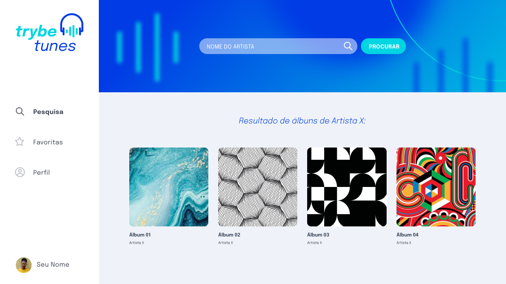

<p align="center">
  
  <br>
  <br>
  <hr />
</p>

<p align="center">
  A project developed at Trybe's Front-End Module
</p>

<br>

<p align="center">


    

</p>

## 📋 About
At this project you can search for albums and play their songs.


<em>website mockup design</em>

## 💻 Technology
- React
- React Router

## ✨ Features 
- Search for albums by artist
- listen song preview
- favorite songs

## 🧠 What I learned
At this project, I learned how to use React Router and how React Lifecycle works.

## 📦 Running
> use Node version 14

```bash
npm i
```
```bash 
npm start
```
